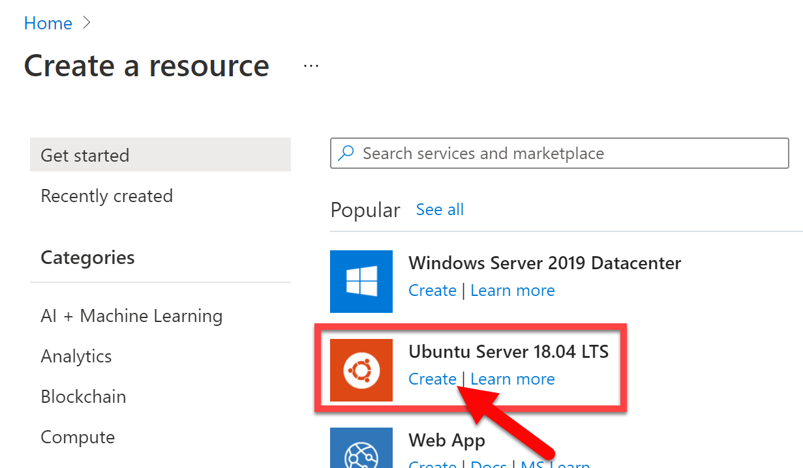
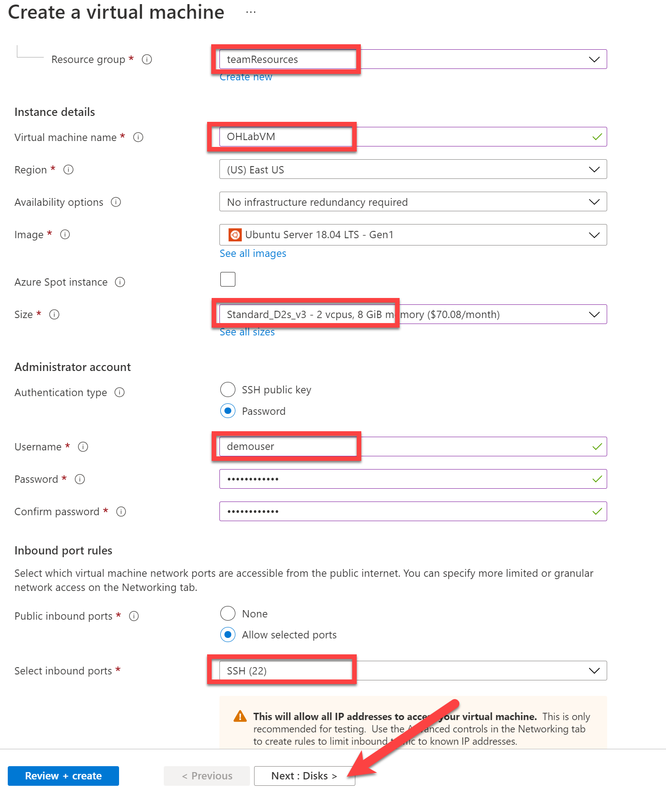
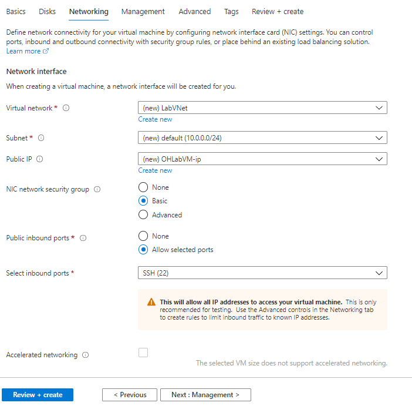
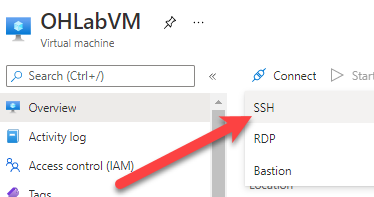
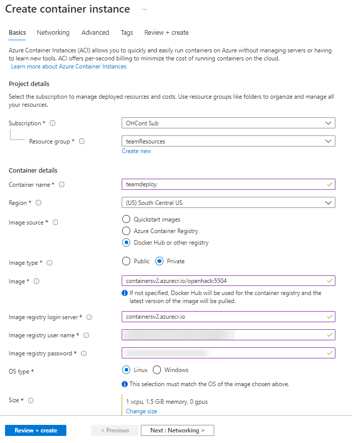

# BYOS: Bring your own Subscription

If you are utilizing your own Azure subscription for this set of challenges, you will want to get your environment ready.  Follow the steps below to setup your environment to be ready for the first challenge.

## Resources

You will need to have resources deployed in subscription.  These can be deployed using the Azure Resource Management (ARM) template found here:
<!-- UPDATE the below URL depending on where the template is deployed -->
[azureDeploy.json](https://raw.githubusercontent.com/Microsoft-OpenHack/containers/main/tooling/azuredeploy.json?token=AKHDDMWGYNBNFNIIRNL7VSTATL3PU)

## Tools and deployments

You can use the Azure template `azureDeploy.json` above deploy the resources, but there are manual steps following you can run as well.

### ARM Deployment

If you are using the ``azureDeploy.json`` ARM template, you will want to update at least two variables in the template:

```json
...
    "variables": {
        "azureUserName": "",
        "azurePassword": "",
...
```

Use these values:

| Variable | Description | Example |
| -------- | ----------- | ------- |
| `azureUserName` | Account in Azure AD with ability to create Resources in the `teamResources` and `ProctorVMRG` resource groups. | `deployUser@domain.onmicrosoft.com` |
| `azurePassword` | Password for the `azureUserName`. Must be escaped if using characters like `\` | `Password@123!` |

### Manual deployment

If you would rather deploy the resources manually, follow these steps.

#### Create the VM for management

This will allow you to deploy a Linux VM that can be used to manage, deploy, and control the environment with the tools needed:

1. Logon to the [Azure Portal](https://portal.azure.com)
1. Go to **Resource groups**
1. Create the following 2 resource groups in the region closest to you:

    * `teamResources`
    * `ProctorVMRG`

1. Go to **Create a resource** to create a new resource from the Marketplace
1. Choose the **Ubuntu Server**

    

1. Use the following values:

    | Field | Value |
    | - | - |
    | Resource group | teamResources |
    | VM Name | OHLabVM |
    | Size | D2s v3 |
    | Username | demouser |
    | Auth type | Password (unless you're familiar with using SSH pub keys) |
    | Inbound ports | Allow SSH (22) |

    

1. The click **Next : Disks >**
1. Click **Next : Networking >** to continue on to networks
1. Ensure the VM is attaching to a subnet (existing or new) with at least a `/27` mask, a public IP, and basic NIC NSG that allows SSH

1. Click **Review + create** and **Create** this VM

#### Install Tools on VM

Once the Ubuntu VM has been created, these are the commands to install the tools that will be useful to use with the resources.

1. Go to the **OHLabVM** in your subscription
1. From the Overview, tab click **Connect** and **SSH**

    

1. This page will have the instructions for connecting to the VM.  Step 4 on this screen will list the username and public IP to use to connect with.
1. Once connected, use this command to install **Azure CLI**

    ```bash
    curl -sL https://aka.ms/InstallAzureCLIDeb | sudo bash
    ```

1. Install **Docker** using `snap`

    ```bash
    sudo snap install docker
    ```

1. Install **Kubernetes** with `helm` using `snap`

    ```bash
    sudo snap install kubectl --classic
    sudo snap install helm --classic
    ```

1. Clean up the installation packages with `autoremove`

    ```bash
    sudo apt -y autoremove
    ```

Alternatively, all of those commands can be run using this script together:

```bash
curl -sL https://aka.ms/InstallAzureCLIDeb | sudo bash

sudo snap install docker

sudo snap install kubectl --classic
sudo snap install helm --classic

sudo apt -y autoremove
```

#### Deploy container image

To setup and configure resources for this challenge, use these commands to use a container image configured to deploy to your subscription.

1. From the portal, **Create a resource**
1. Search for **Container Instances** and **Create** a new instance
1. Place the container in the **teamResources** resource group
1. Use an image source of **Docker Hub or other registry**
1. For image type, use **Private**
1. Use the following for the image name:

    ```azurecli
    containersv2.azurecr.io/openhack:5504
    ```

1. For the login server use `containersv2.azurecr.io`
1. The registry user name and password will be provided separately
1. Use 1 CPU and 1.5GiB for the size

1. Click **Next : Networking >**
1. Set networking type to **None**
1. Click **Next : Advanced**
1. Add in the following Environment variables

    | Key | Value |
    | --- | ----- |
    | AZUREUSER | \<username in Azure AD with rights to create resources (ensure MFA is not enabled)\> |
    | AZUREPASS | \<password for user listed in AZUREUSER\> |
    | SUBID | \<current Azure subscription ID\> |
    | RGLOCATION | \<Azure region where other resources are located\> |
    | SIMULATORLOCATION | \<Same Azure region as RGLOCATION\> |
    | RECIPIENTEMAIL | \<your E-mail address\> |

1. Click **Review + create**
1. Click **Create** to deploy the container

## Repository

When working with a team of users it is useful to setup a repository for storing files and potentially deploying resources from.  To save time, ensure setting up either an **Azure DevOps** project repository or **GitHub** repo to be shared with your team.

* [Setup Azure DevOps Project](https://docs.microsoft.com/en-us/azure/devops/user-guide/sign-up-invite-teammates?toc=%2Fazure%2Fdevops%2Fget-started%2Ftoc.json&bc=%2Fazure%2Fdevops%2Fget-started%2Fbreadcrumb%2Ftoc.json&view=azure-devops#sign-up-with-a-personal-microsoft-account)
* [Creating a GitHub repo](https://docs.github.com/en/get-started/quickstart/create-a-repo)

## References

* [Create Linux VM in Azure](https://docs.microsoft.com/en-us/azure/virtual-machines/linux/quick-create-portal)
* [Install Azure CLI on Linux](https://docs.microsoft.com/en-us/cli/azure/install-azure-cli-linux?pivots=apt)
* [Azure Container Instances](https://docs.microsoft.com/en-us/azure/container-instances/)
* [Installing docker on Ubuntu](https://snapcraft.io/install/docker/ubuntu)
* [Kubernetes on Ubuntu](https://ubuntu.com/kubernetes)
